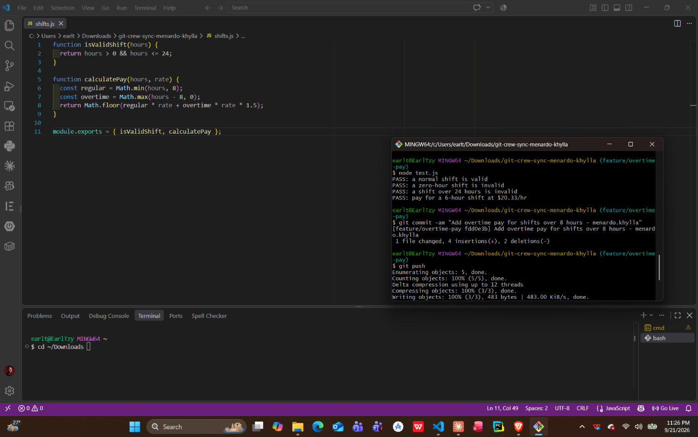
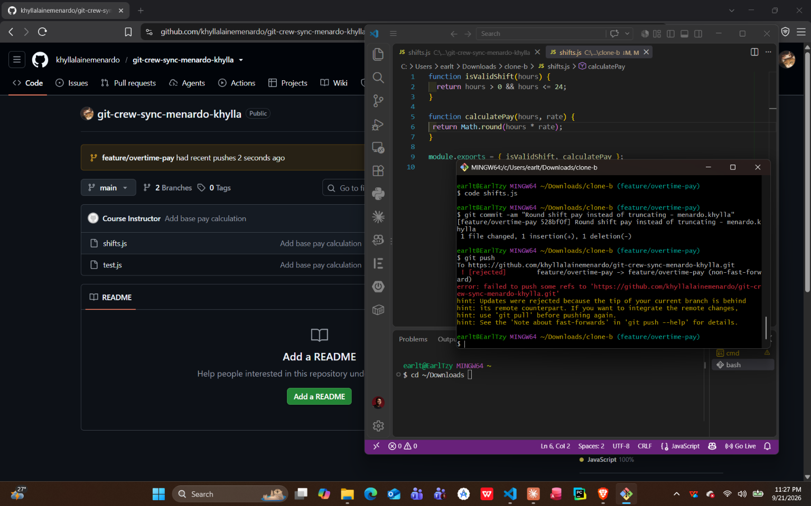
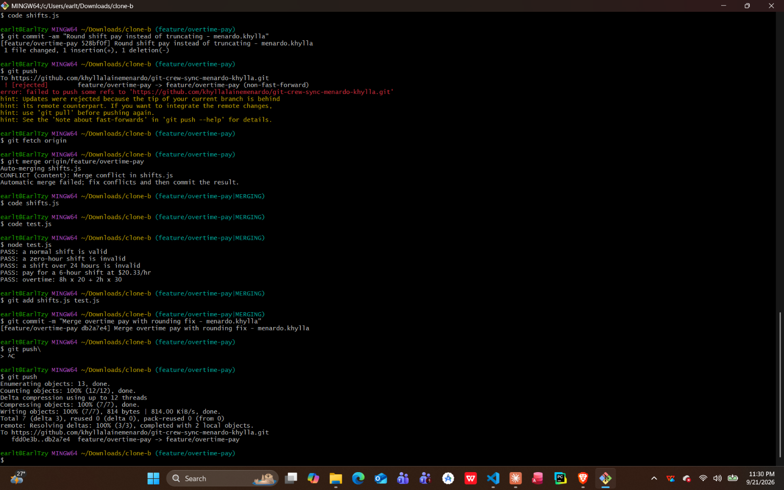
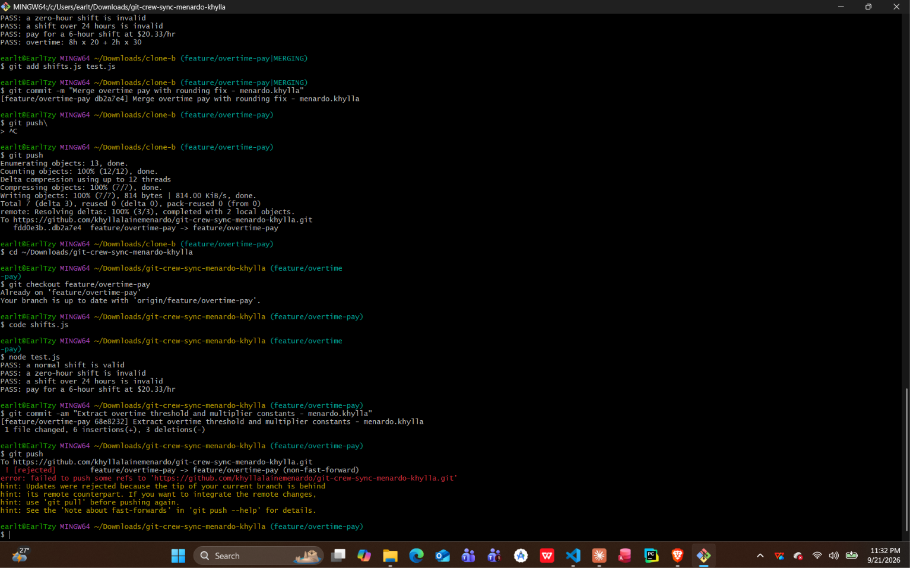
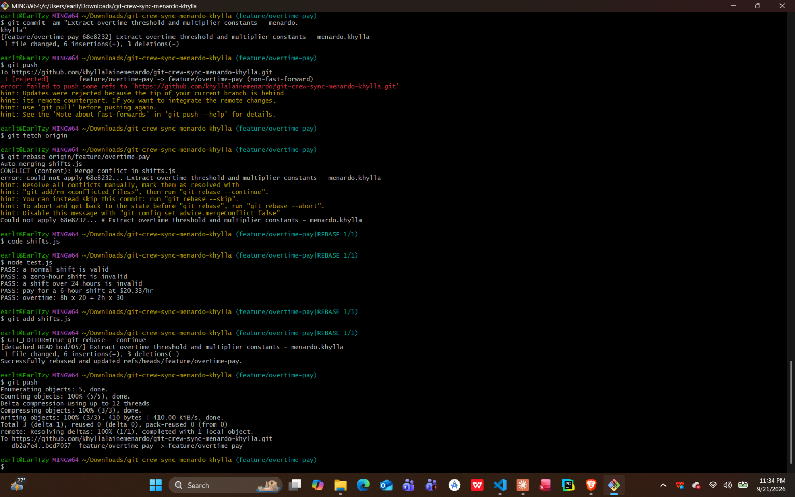
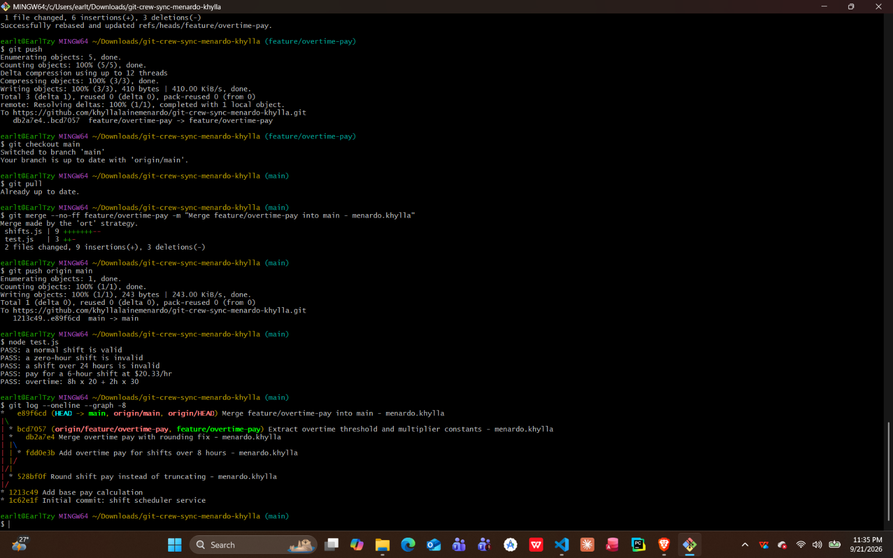
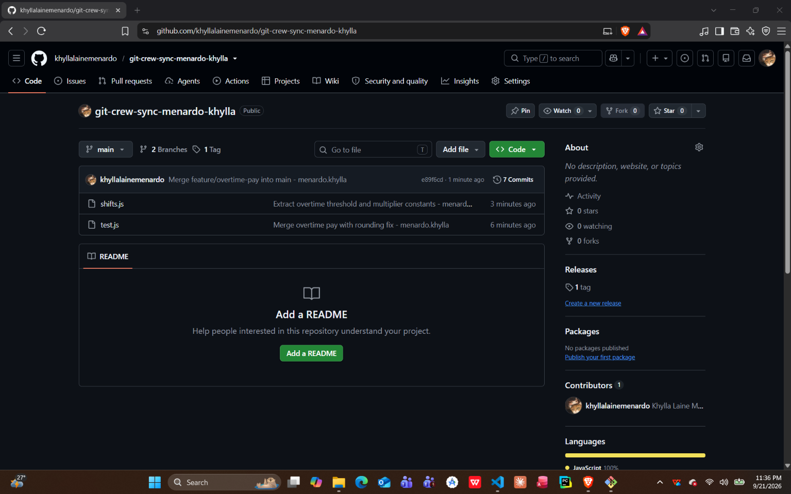

# Crew Sync – Git Team Workflow

**Repository:** git-crew-sync-menardo-khylla
**Author:** menardo.khylla

---

## Task 1 – Push a change from Clone A

In Clone A I checked out `feature/overtime-pay` and changed `calculatePay` so any hours past 8 are paid at time-and-a-half (1.5×). I committed it and pushed. Clone A's push went through because nothing new had landed on `origin/feature/overtime-pay` since the clone.

## Task 2 – Diverge from Clone B and get rejected

In Clone B (which hadn't fetched Clone A's push) I changed the same function to round the pay (`Math.round`) instead of truncating it (`Math.floor`). I committed it and tried to push. The push was rejected.

## Task 3 – Reconcile with a merge

In Clone B I ran `git fetch` and `git merge origin/feature/overtime-pay`. Git stopped on a conflict in `calculatePay`, because both commits had changed the same `return` line. I resolved it by hand so both behaviors stay: the overtime split (8 regular hours plus 1.5× for the rest) from Clone A, with the final total rounded as in Clone B. Rounding changes the result for a 6-hour shift at $20.33/hr from 121 to 122 (121.98 is now rounded instead of truncated), so I updated that expectation in `test.js`. I also added an overtime test: 10 hours at $20 → 8×20 + 2×30 = 220. `node test.js` passed. I committed the merge with my name in the message and pushed.

## Task 4 – Diverge again and reconcile with a rebase

Back in Clone A, without fetching, I made one more change to `calculatePay`: I replaced the magic numbers with named constants (`OVERTIME_THRESHOLD = 8`, `OVERTIME_MULTIPLIER = 1.5`). The push was rejected again, because Clone B's merge commit was now on the remote. This time I ran `git fetch` and then `git rebase origin/feature/overtime-pay`. Git replayed my one new commit on top of the remote branch and hit a conflict on the `return` line. I kept `Math.round` from upstream along with my new constants, then ran `git add` and `git rebase --continue`. The tests passed, and a normal `git push` worked without `--force`.

## Task 5 – Merge into main

In Clone A I checked out `main`, merged `feature/overtime-pay` into it with `--no-ff`, and pushed `main`.

## Task 6 – Tag

I tagged the final merge commit on `main` as `v1.0-synced` and ran `git push --tags`.

---

## Reflection questions

### 1. What did the rejected push error message tell you, and why did it happen?

The message was `! [rejected] feature/overtime-pay -> feature/overtime-pay (fetch first)`, followed by `error: failed to push some refs`. The hint said the remote contains work that I do not have locally, and that I should integrate the remote changes (for example with `git pull`) before pushing again.

It happened because both clones started from the same commit, and Clone A pushed first. That moved `origin/feature/overtime-pay` forward. Clone B's commit was built on the old tip, so its history no longer contained the remote tip. A push only succeeds when it is a fast-forward, meaning the remote's current commit is an ancestor of what you are pushing. Here it wasn't. If Git had accepted the push, Clone A's overtime commit would have been thrown away. So Git refused and made me integrate first.

### 2. What's the actual difference between how you resolved Task 3 (merge) vs Task 4 (rebase)?

**Merge (Task 3):** Clone B kept its commit exactly as it was. Git created a new merge commit with two parents, Clone A's commit and Clone B's commit. I resolved the conflict once, inside that merge commit. The history shows the truth: two lines of work split apart and were joined back together. No existing commit was rewritten.

**Rebase (Task 4):** Clone A's new commit was taken off, and the same change was replayed on top of the latest remote tip. That produced a new commit with a new hash and a new parent. I resolved the conflict while that commit was being replayed. During a rebase, "ours" is the upstream branch and "theirs" is my own commit, which is the reverse of a merge. The result is a straight line with no merge commit, as if I had written my change after Clone B's work. The push didn't need force because the rewritten commit had only ever existed on my machine. It had never been pushed, so no shared history was changed.

In short: a merge keeps history and adds a join point. A rebase rewrites my own unpushed commits so the history stays linear.

### 3. What one habit would have avoided both rejected pushes in this lab?

**Always run `git pull` (or `git fetch` and then integrate) before starting work and again before pushing.** Both rejections happened because a clone committed on an old copy of the branch. If I sync first, my commits are built on the current remote tip, so the push is a fast-forward. Real conflicts can still happen if two people edit the same lines at the same time. But I would catch them locally while integrating, instead of finding out from a rejected push.

### 4. Which approach – merge or rebase – would you default to on a shared team branch, and why?

**I would default to rebase for my own local, unpushed commits (`git pull --rebase`), and merge for anything that is already shared.**

When I'm syncing my local commits with the shared branch, rebasing keeps the history linear and easy to read. It avoids a pile of "Merge branch 'origin/...'" commits that add no meaning. It's safe because the commits being rewritten have never left my machine, just like in Task 4.

I would never rebase commits that other people have already pulled. Rewriting them changes their hashes, so the next push would need `--force`, and teammates' clones would be out of sync with the rewritten branch. For those cases, and for bringing a finished feature into `main` (Task 5), a merge is the safer default. It never rewrites shared history, and the merge commit records when the feature was joined in.

The rule I'd follow: **rebase what's private, merge what's public.**
